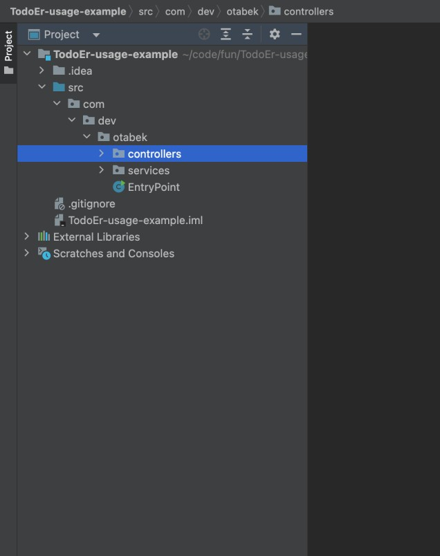
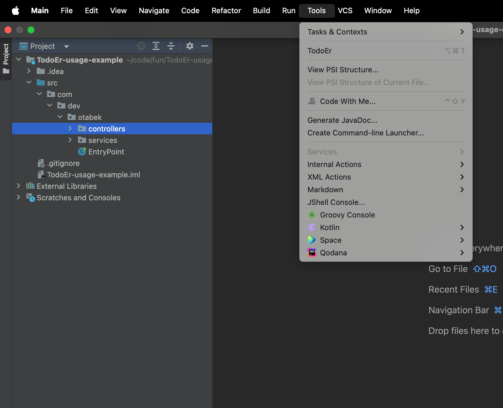
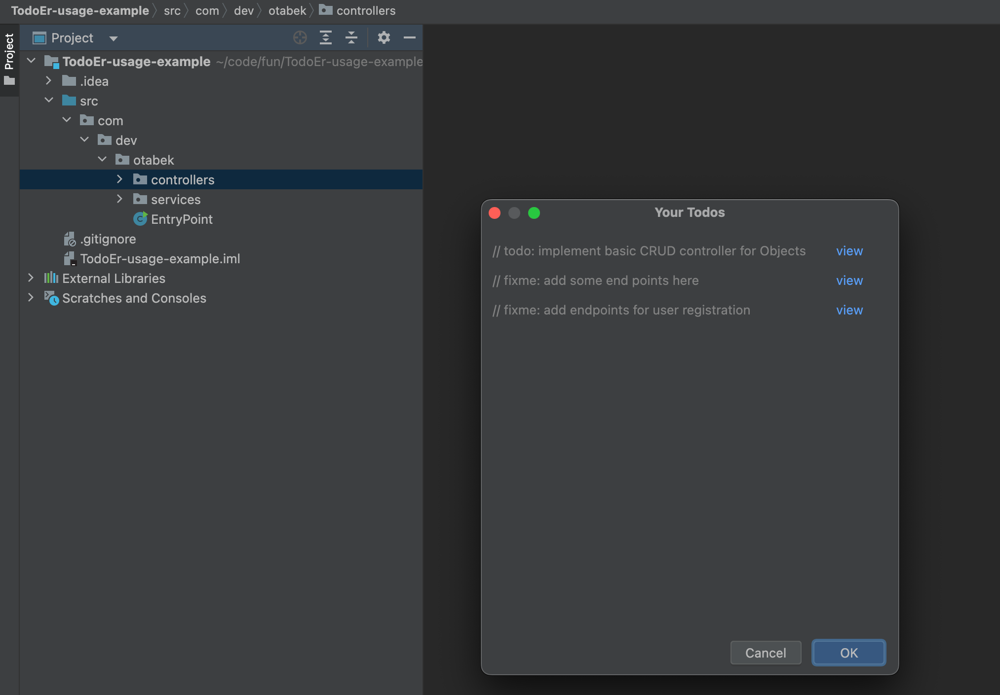
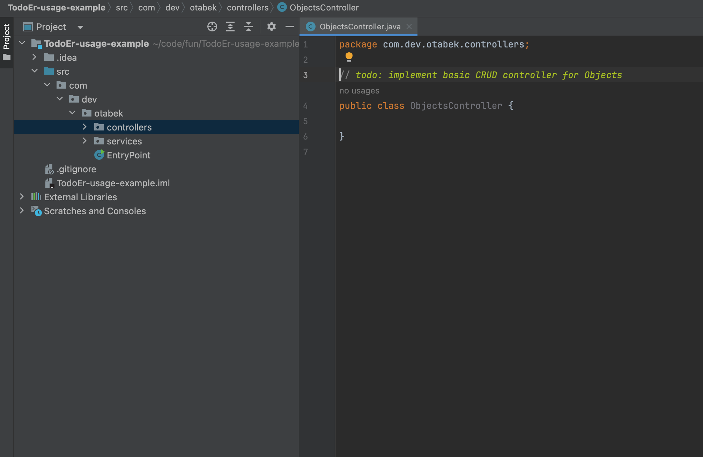

# TodoEr - Your Ultimate TODO Helper

<!-- Plugin description -->
**TodoEr** is a plugin for JetBrains-based IDEs that highlights all commented `TODO`s in your project source code.

As developers, it's easy to forget to fix our `TODO`s, which sometimes results in unfinished tasks being pushed for code
review or production. This can be both frustrating and unprofessional. **TodoEr** was created to make `TODO`s visible
and easily trackable before submitting code, ensuring nothing important slips through. I hope it helps you too!

## Features

1. **Efficient TODO Tracking**: TodoEr scans the selected folder or file for all `TODO` comments, ensuring you never
   miss one.
2. **Customizable TODO Patterns**: The plugin retrieves `TODO` patterns from your IntelliJ settings, allowing you to use
   any specified patterns such as `// TODO`, `// FIXME`, or any other custom patterns you’ve defined.
3. **Fast Performance**: Capable of scanning large projects (e.g., 7,000+ files) in under a second.
4. **Shortcut Accessibility**: Use `CTRL + ALT + T` to instantly open TodoEr.

TodoEr is a simple helper tool designed to help you complete tasks on time and push clean, production-ready code. No
need to manually scan each file you've edited to check for unfinished tasks—TodoEr does it for you!

### Limitation

- Currently, the plugin only supports single-line comments (`//`) in the source code.

<!-- Plugin description end -->

## Step-by-Step Instructions to Use the Plugin

### Step One

Select a folder or file you want to view `TODO`s.

### Step Two

Go to the **Tools** menu and select **TodoEr** or simply press the shortcut.

### Step Three

Choose which `TODO` to view.

And bam, you'll see your `TODO` opened!

